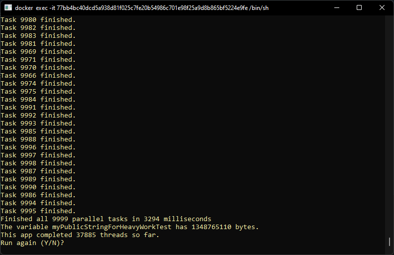
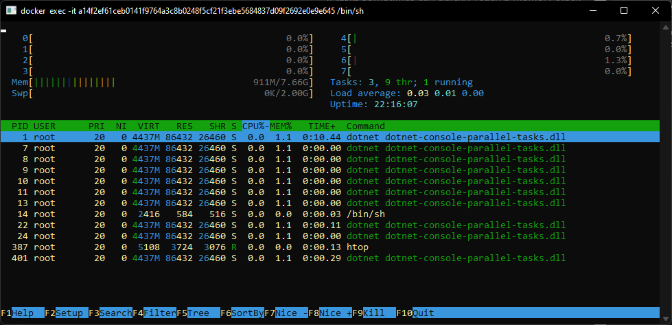

# Context
Sometimes we can call independent parallel tasks to process many things at same time.
The program finishes when all tasks are completed.
You just need to wait for all tasks completition before return final results.

> **Important:** Multi-threading applications with many parallel tasks sometimes can quickly reach a memory stack overflow. In this app you can see and monitor how many memory the app is allocating, a sample memory cleaning but it do not prevent stack overflow error. Try it!

# What does this application do?
- The app asks how many parallel tasks the user you want to run (2 up to 10.000 heavy tasks)
- Then, it runs these many tasks where each thread does a heavy work with high memory use (big string concatenations)
- After await all tasks completition, it shows the execution time, bytes created in memory and let you see memory usage (windows task manager or htop in Linux)
- Ask if you want to run again the app or if you want to quit the program
- If you choose to run again, the Garbage Collector is called, memory is cleaned and it waits next tasks quantity to run again (this is a good moment to check the memory allocation decreasing)
 
  

# Stack and main topics in the project
- .NET 6.0 console application
    - C# 
    - Multi-threading (parallel async / await tasks)
    - ThreadPool resizing (System.Threading.ThreadPool.SetMaxThreads)
    - Taks monitoring -> await Task.WhenAll(myTasks)
    - Duration calculation and format to milliseconds
    - String interpolation and Verbatim strings
    - Console input, output and cleaning
    - Garbage Collector usage

- Docker
    - docker build
    - docker run
    - docker container bash interaction (from docker's host shell)


# About the Author and license
- **Erick** is a Senior Backend Developer and Architect. 
- You can reach **Erick** by email <seixaserick77@gmail.com> or Linkedin <https://www.linkedin.com/in/seixaserick/>
- Other Github Repositories: <https://github.com/seixaserick/> 
- MIT License (please check [LICENSE.txt](LICENSE.txt) for more details)


# How to run this project 

## Clone the repository

If you already installed Git for Windows, run commands below:
```
git clone https://github.com/seixaserick/dotnet-console-parallel-tasks
cd dotnet-console-parallel-tasks
```


# How to run this project in Docker containers
> If you already installed Docker Desktop, just follow these steps below


## Creating a docker image
To create a Docker image, run command line below in the command prompt of project directory:
```
docker build -t dotnet-console-parallel-tasks -f Dockerfile .
```


## Running the app in a docker container


To run the image in Docker container and interact with it, run command line below: 
```
docker run -it --name=dotnet-console-parallel-tasks --restart=unless-stopped dotnet-console-parallel-tasks
```

To stop the container, run command line below: 
```
docker stop dotnet-console-parallel-tasks
```

To remove the container (even if it is running), run command line below: 
```
docker rm --force dotnet-console-parallel-tasks
```

# How to build and run without Docker (Windows)

> After clone the repository you can open the project with Visual Studio. Build or just debug it pressing ```F5```.

## To compile and run it in Windows (Visual Studio required)
> Open the solution file ```dotnet-console-parallel-tasks.sln``` with your Visual Studio, then press ```F5``` to run the project!


# Takeaways

- Multi-threading apps are more simple and usual then we think.
- Be careful about too many parallel tasks because you can reach a memory stack overflow.
- Dotnet apps (console or not) can run in Linux or Windows OS.
- Docker is a nice tool to run projects quickly without concern about dependencies and configurations.
- C# is very similar to other ECMA-based languages (Java, Javascript etc.)
- Console apps are simple and easy to input and output data.
- Good Markdown README.md files can help other developers to understand, clone, run and test projects.

# Homework challenge

1. Change the maximum allowed number of threads and try to run 100.000 threads (did you get a stack overflow?)
2. Change the ```void HeavyWork()``` procedure replacing the **StringBuilder** ```.AppendLine()``` by a simple string concatenation ```str += "concat text";``` and see the tremendous speed degradation.
3. Change the ```await Task.WhenAll(myTasks);``` for  ```await Task.WhenAny(myTasks);``` and see what happens with your console output and execution time.
4. Inspect the Dockerfile content to see how docker pulls imagens from images's hub
5. Try to see memory allocation directly in container's bash
    - Open Docker Desktop application
    - Go to containers list
    - Click on ```dotnet-console-parallel-tasks``` container
    - Open the container bash.
    - Update container dependencies running ```apt-get update```
    - Upgrade container dependencies running ```apt-get upgrade```
    - Run ```apt-get install htop``` to install **htop**
    - Run ```htop``` to open **htop**  (*It's like Windows Task Manager*) 
    - Run the container on your Windows Prompt ```docker run -it --name=dotnet-console-parallel-tasks dotnet-console-parallel-tasks``` and see in ```htop``` the memory and CPU increase when you request 9.999 parallel tasks

      